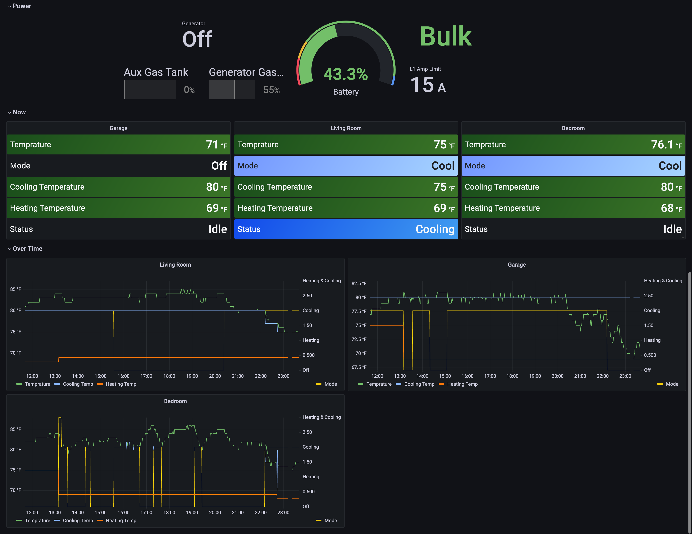

# LCI Gateway Exporter

Currently exports: Generator, HVAC, Tanks, Switches, and Dimmers.
Makes a great companion to something like [Prometheus](https://prometheus.io/) and [Grafana.](https://grafana.com/)
Allowing you to create alarms for things HVAC temprature, tank level, or genrator run time.
This must be run on the same network as your LCI gateway. Eg, you should be able to see a JSON response [from the gateway.](http://192.168.1.4:8080/rest/things/)

**Disclaimer:** Not officially supported. Developer(s) not associated with the LCI brand or company.

## Docker Image
Quick start: `docker run -p 8888:8888 theempty/lci-gateway-exporter:latest`

Currently no supported configurable settings.

## Example Dashboards
### HVAC
Note: Battery percentage and charging status is coming from Victron.



## _You might also like_

### [Generator Manager](https://github.com/TheEmpty/generator-manager)
Requires: Victron system and an LCI gateway with a generator.

Automatically start the generator when low battery is reach (configurable percentage),
stopping when the battery reaches your configured threshold. The generator manager
will also change your AC input limit as you've configured when using the generator
and switch back to your shore limit when the generator is off. Even if you manually
start the generator.

## Example metrics output

```
# HELP lci_gateway_living_room_climate_zone_online Online state, Offline = 0, Online = 1, Locked = 2
# TYPE lci_gateway_living_room_climate_zone_online gauge
lci_gateway_living_room_climate_zone_online 1
# HELP lci_gateway_living_room_climate_zone_outside_temprature HVAC outside temprature
# TYPE lci_gateway_living_room_climate_zone_outside_temprature gauge
lci_gateway_living_room_climate_zone_outside_temprature 47.9375
# HELP lci_gateway_living_room_climate_zone_inside_temprature HVAC inside temprature
# TYPE lci_gateway_living_room_climate_zone_inside_temprature gauge
lci_gateway_living_room_climate_zone_inside_temprature 87
# HELP lci_gateway_living_room_climate_zone_fan Fan state. Auto = 0, Low = 1, High = 2
# TYPE lci_gateway_living_room_climate_zone_fan gauge
lci_gateway_living_room_climate_zone_fan 0
# HELP lci_gateway_living_room_climate_zone_mode A/C mode. Off = 0, Heat = 1, Cool = 2, Heat-Cool = 3
# TYPE lci_gateway_living_room_climate_zone_mode gauge
lci_gateway_living_room_climate_zone_mode 2

# HELP lci_gateway_garage_climate_zone_online Online state, Offline = 0, Online = 1, Locked = 2
# TYPE lci_gateway_garage_climate_zone_online gauge
lci_gateway_garage_climate_zone_online 1
# HELP lci_gateway_garage_climate_zone_outside_temprature HVAC outside temprature
# TYPE lci_gateway_garage_climate_zone_outside_temprature gauge
lci_gateway_garage_climate_zone_outside_temprature 47.9375
# HELP lci_gateway_garage_climate_zone_inside_temprature HVAC inside temprature
# TYPE lci_gateway_garage_climate_zone_inside_temprature gauge
lci_gateway_garage_climate_zone_inside_temprature 80.75
# HELP lci_gateway_garage_climate_zone_fan Fan state. Auto = 0, Low = 1, High = 2
# TYPE lci_gateway_garage_climate_zone_fan gauge
lci_gateway_garage_climate_zone_fan 0
# HELP lci_gateway_garage_climate_zone_mode A/C mode. Off = 0, Heat = 1, Cool = 2, Heat-Cool = 3
# TYPE lci_gateway_garage_climate_zone_mode gauge
lci_gateway_garage_climate_zone_mode 2

# HELP lci_gateway_black_tank_2_online Online state, Offline = 0, Online = 1, Locked = 2
# TYPE lci_gateway_black_tank_2_online gauge
lci_gateway_black_tank_2_online 1
# HELP lci_gateway_black_tank_2 Tank percentage
# TYPE lci_gateway_black_tank_2 gauge
lci_gateway_black_tank_2 0

# HELP lci_gateway_gas_water_heater_online Online state, Offline = 0, Online = 1, Locked = 2
# TYPE lci_gateway_gas_water_heater_online gauge
lci_gateway_gas_water_heater_online 1
# HELP lci_gateway_gas_water_heater_relay_current Switch relay current
# TYPE lci_gateway_gas_water_heater_relay_current gauge
lci_gateway_gas_water_heater_relay_current 0
# HELP lci_gateway_gas_water_heater_state Switch state. Off = 0, On = 1
# TYPE lci_gateway_gas_water_heater_state gauge
lci_gateway_gas_water_heater_state 0
# HELP lci_gateway_gas_water_heater_fault Switch state. Off = 0, On = 1
# TYPE lci_gateway_gas_water_heater_fault gauge
lci_gateway_gas_water_heater_fault 0

# HELP lci_gateway_awning_light_online Online state, Offline = 0, Online = 1, Locked = 2
# TYPE lci_gateway_awning_light_online gauge
lci_gateway_awning_light_online 1
# HELP lci_gateway_awning_light_state Switch state. Off = 0, On = 1
# TYPE lci_gateway_awning_light_state gauge
lci_gateway_awning_light_state 0

# HELP lci_gateway_water_pump_online Online state, Offline = 0, Online = 1, Locked = 2
# TYPE lci_gateway_water_pump_online gauge
lci_gateway_water_pump_online 1
# HELP lci_gateway_water_pump_relay_current Switch relay current
# TYPE lci_gateway_water_pump_relay_current gauge
lci_gateway_water_pump_relay_current 0.125
# HELP lci_gateway_water_pump_state Switch state. Off = 0, On = 1
# TYPE lci_gateway_water_pump_state gauge
lci_gateway_water_pump_state 0
# HELP lci_gateway_water_pump_fault Switch state. Off = 0, On = 1
# TYPE lci_gateway_water_pump_fault gauge
lci_gateway_water_pump_fault 0

# HELP lci_gateway_fresh_tank_online Online state, Offline = 0, Online = 1, Locked = 2
# TYPE lci_gateway_fresh_tank_online gauge
lci_gateway_fresh_tank_online 1
# HELP lci_gateway_fresh_tank Tank percentage
# TYPE lci_gateway_fresh_tank gauge
lci_gateway_fresh_tank 0

# HELP lci_gateway_generator_online Online state, Offline = 0, Online = 1, Locked = 2
# TYPE lci_gateway_generator_online gauge
lci_gateway_generator_online 1
# HELP lci_gateway_generator_state Generator state. Off = 0, Priming = 1, Starting = 2, Running = 3
# TYPE lci_gateway_generator_state gauge
lci_gateway_generator_state 3

# HELP lci_gateway_electric_water_heater_online Online state, Offline = 0, Online = 1, Locked = 2
# TYPE lci_gateway_electric_water_heater_online gauge
lci_gateway_electric_water_heater_online 1
# HELP lci_gateway_electric_water_heater_relay_current Switch relay current
# TYPE lci_gateway_electric_water_heater_relay_current gauge
lci_gateway_electric_water_heater_relay_current 0
# HELP lci_gateway_electric_water_heater_state Switch state. Off = 0, On = 1
# TYPE lci_gateway_electric_water_heater_state gauge
lci_gateway_electric_water_heater_state 0
# HELP lci_gateway_electric_water_heater_fault Switch state. Off = 0, On = 1
# TYPE lci_gateway_electric_water_heater_fault gauge
lci_gateway_electric_water_heater_fault 0

# HELP lci_gateway_black_tank_online Online state, Offline = 0, Online = 1, Locked = 2
# TYPE lci_gateway_black_tank_online gauge
lci_gateway_black_tank_online 1
# HELP lci_gateway_black_tank Tank percentage
# TYPE lci_gateway_black_tank gauge
lci_gateway_black_tank 33

# HELP lci_gateway_water_tank_heater_online Online state, Offline = 0, Online = 1, Locked = 2
# TYPE lci_gateway_water_tank_heater_online gauge
lci_gateway_water_tank_heater_online 1
# HELP lci_gateway_water_tank_heater_relay_current Switch relay current
# TYPE lci_gateway_water_tank_heater_relay_current gauge
lci_gateway_water_tank_heater_relay_current 0.1210938
# HELP lci_gateway_water_tank_heater_state Switch state. Off = 0, On = 1
# TYPE lci_gateway_water_tank_heater_state gauge
lci_gateway_water_tank_heater_state 0
# HELP lci_gateway_water_tank_heater_fault Switch state. Off = 0, On = 1
# TYPE lci_gateway_water_tank_heater_fault gauge
lci_gateway_water_tank_heater_fault 0

# HELP lci_gateway_auxilliary_fuel_tank_online Online state, Offline = 0, Online = 1, Locked = 2
# TYPE lci_gateway_auxilliary_fuel_tank_online gauge
lci_gateway_auxilliary_fuel_tank_online 1
# HELP lci_gateway_auxilliary_fuel_tank Tank percentage
# TYPE lci_gateway_auxilliary_fuel_tank gauge
lci_gateway_auxilliary_fuel_tank 11

# HELP lci_gateway_bedroom_climate_zone_online Online state, Offline = 0, Online = 1, Locked = 2
# TYPE lci_gateway_bedroom_climate_zone_online gauge
lci_gateway_bedroom_climate_zone_online 1
# HELP lci_gateway_bedroom_climate_zone_outside_temprature HVAC outside temprature
# TYPE lci_gateway_bedroom_climate_zone_outside_temprature gauge
lci_gateway_bedroom_climate_zone_outside_temprature 47.9375
# HELP lci_gateway_bedroom_climate_zone_inside_temprature HVAC inside temprature
# TYPE lci_gateway_bedroom_climate_zone_inside_temprature gauge
lci_gateway_bedroom_climate_zone_inside_temprature 89
# HELP lci_gateway_bedroom_climate_zone_fan Fan state. Auto = 0, Low = 1, High = 2
# TYPE lci_gateway_bedroom_climate_zone_fan gauge
lci_gateway_bedroom_climate_zone_fan 1
# HELP lci_gateway_bedroom_climate_zone_mode A/C mode. Off = 0, Heat = 1, Cool = 2, Heat-Cool = 3
# TYPE lci_gateway_bedroom_climate_zone_mode gauge
lci_gateway_bedroom_climate_zone_mode 0

# HELP lci_gateway_grey_tank_online Online state, Offline = 0, Online = 1, Locked = 2
# TYPE lci_gateway_grey_tank_online gauge
lci_gateway_grey_tank_online 1
# HELP lci_gateway_grey_tank Tank percentage
# TYPE lci_gateway_grey_tank gauge
lci_gateway_grey_tank 33

# HELP lci_gateway_generator_fuel_tank_online Online state, Offline = 0, Online = 1, Locked = 2
# TYPE lci_gateway_generator_fuel_tank_online gauge
lci_gateway_generator_fuel_tank_online 1
# HELP lci_gateway_generator_fuel_tank Tank percentage
# TYPE lci_gateway_generator_fuel_tank gauge
lci_gateway_generator_fuel_tank 0
```
